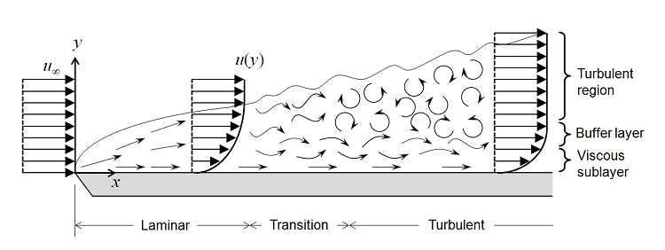
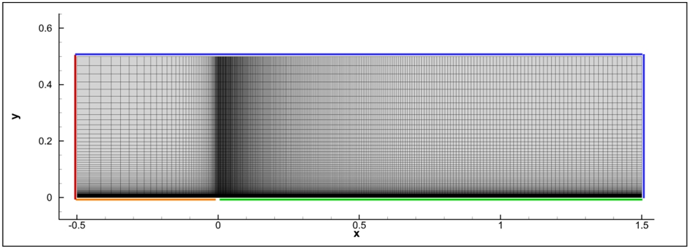
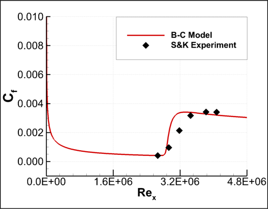
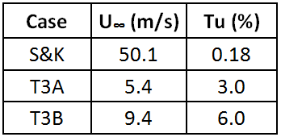

Transitional Flat Plate
=====



## Goals

Upon completing this tutorial, the user will be familiar with performing an external, transitional flow over a flat plate. The flow over the flat plate will be laminar until it reaches a point where a transition correlation depending on local flow variables is activated. The results can be compared to the zero pressure gradient natural transition experiment of Schubauer & Klebanoff [1]. The following capabilities of SU2 will be showcased in this tutorial:

- Steady, 2D, incompressible RANS equations
- Spalart-Allmaras (S-A) turbulence model with Bas-Cakmakcioglu (B-C) transition model
- Roe 2nd-order numerical scheme in space
- Euler implicit time integration
- Inlet, Outlet, Symmetry and No-Slip Wall boundary conditions

## Resources

The resources for this tutorial can be found in the TestCases/transition/Schubauer_Klebanoff directory. You will need the configuration file (transitional_BC_model_ConfigFile.cfg) and the mesh file (grid.su2). The configuration file can be found in the SU2 repository whereas the mesh file can be found in the TestCases repository.
Additionally, experimental skin friction data corresponding to this test case is provided in the TestCases repository (All_ZeroPresGrad_FlatPlateExperiments.dat).

## Tutorial

The following tutorial will walk you through the steps required when solving for the transitional flow over a flat plate using SU2. It is assumed you have already obtained and compiled the SU2_CFD code for a serial or parallel computation. If you have yet to complete these requirements, please see the Download and Installation pages.

### Background

Practically, most CFD analyses are carried out using full turbulence models which do not account for boundary layer transition. Using the turbulence models, the flow is everywhere fully turbulent, thus no separation bubbles or other complex flow phenomena involve. Introducing a transition model, the flow begins as laminar by damping the production term of the turbulence model until a point where a transition correlation is activated. Currently, Bas-Cakmakcioglu (B-C) transition model [2] that uses Spalart-Allmaras (S-A) as the baseline turbulence model is implemented in the SU2.

For verification, we will be comparing SU2 results against the results of natural transition flat plate experiment of Schubauer & Klebanoff. The experimental data include skin friction coefficient distribution versus the local Reynolds number over the flat plate.

### Problem Setup

The length of the flat plate is 1.5 meters, and it is represented by an adiabatic no-slip wall boundary condition. There is a symmetry plane located before the leading edge of the flat plate. Inlet boundary condition is used on the left boundary of the domain, and outlet boundary condition is applied to the top and right boundaries of the domain. The freestream velocity, density, viscosity and turbulence intensity (%) is specified as 50.1 m/s, 1.2 kg/m^3, 1.8e-05 and 0.18%, respectively. Since the Mach number is about 0.15, compressibility effects are negligible; therefore, the incompressible flow solver can be employed.

### Mesh Description

The mesh used for this tutorial, which consists of 41,412 quadrilaterals, is shown below.



Figure (1): Mesh with boundary conditions (red: inlet, blue:outlet, orange:symmetry, green:wall)

### Configuration File Options

Several of the key configuration file options for this simulation are highlighted here.

```
% Physical governing equations (EULER, NAVIER_STOKES,
%                               WAVE_EQUATION, HEAT_EQUATION, 
%                               LINEAR_ELASTICITY, POISSON_EQUATION)

PHYSICAL_PROBLEM= NAVIER_STOKES

% Specify turbulent model (NONE, SA, SA_NEG, SST)
KIND_TURB_MODEL= SA

% Specify transition model (NONE, BC)
KIND_TRANS_MODEL= BC

% Specify Turbulence Intensity (%)
FREESTREAM_TURBULENCEINTENSITY = 0.18

% Regime type (COMPRESSIBLE, INCOMPRESSIBLE, FREESURFACE)
REGIME_TYPE= INCOMPRESSIBLE

```

The governing equations are RANS with Spalart-Allmaras (SA) turbulence model. By entering “BC” as the option for “KIND_TRANS_MODEL”, Bas-Cakmakcioglu Algebraic Transition Model is activated. This model requires freestream turbulence intensity that is to be used in the transition correlation, thus “FREESTREAM_TURBULENCEINTENSITY” option is also used. The SA model is composed of one-equation for a turbulence field variable that is directly related to the turbulent eddy viscosity. The BC model achieves its purpose by modifying the production term of the SA model. The production term of the SA model is damped until a considerable amount of turbulent viscosity is generated, and after that point the damping effect of the transition model is disabled, thus a transition from laminar to turbulent flow is obtained.

The incompressible freestream properties are specified as follows. (Please see "Notes" for freestream properties of other transitional flat plate test cases)

```
% Free-stream density (1.2886 Kg/m^3 (air), 998.2 Kg/m^3 (water))
FREESTREAM_DENSITY= 1.2
%
% Free-stream velocity (m/s)
FREESTREAM_VELOCITY= ( 50.1, 0.00, 0.00 )
%
% Free-stream viscosity (1.853E-5 Ns/m^2 (air), 0.798E-3 Ns/m^2 (water))
FREESTREAM_VISCOSITY= 1.8e-05

```

As it can be calculated, the Reynolds number for Schubauer&Klebanoff test case is 3.34e6 for a flat plate of 1 meters. However, in this test case, the length of the flat plate is 1.5 meters. Thus, in the configuration file `REYNOLDS_LENGTH = 1.0` and `REF_AREA= 1.5` are specified.

### Running SU2

To run this test case, follow these steps at a terminal command line:

1.	Copy the config file (transitional_BC_model_ConfigFile.cfg) and the mesh file (grid.su2) so that they are in the same directory. Move to the directory containing the config file and the mesh file. Make sure that the SU2 tools were compiled, installed, and that their install location was added to your path.

2.	Run the executable by entering “SU2_CFD transitional_BC_model_ConfigFile.cfg” at the command line.

3.	SU2 will print residual updates for each iteration of the flow solver, and the simulation will finish upon reaching the specified convergence criteria.

4.	Files containing the results will be written upon exiting SU2. The flow solution can be visualized in Tecplot.

### Results

The figure below compares the skin friction results obtained by the B-C transition model to the experimental data. 



Figure (2): Comparison of the skin friction coefficients for Schubauer&Klebanoff case

## Notes

By changing the freestream velocity and turbulence intensity options in the config file with the values given in the table below, you may also simulate other very popular zero pressure gradient transitional flat plate test cases. You may use the same grid file for these test cases.



## References

[1] Schubauer, G. B., and Klebanoff, P. S., 1955, "Contribution on the Mechanics of Boundary Layer Transition," NACA Technical Note No. TN-3489.

[2] Cakmakcioglu, S. C., Bas, O., and Kaynak, U., “A Correlation-Based Algebraic Transition Model,” Proceedings of the Institution of Mechanical Engineers, Part C: Journal of Mechanical Engineering Science, Accepted on 10/30/2017, https://doi.org/10.1177/0954406217743537
